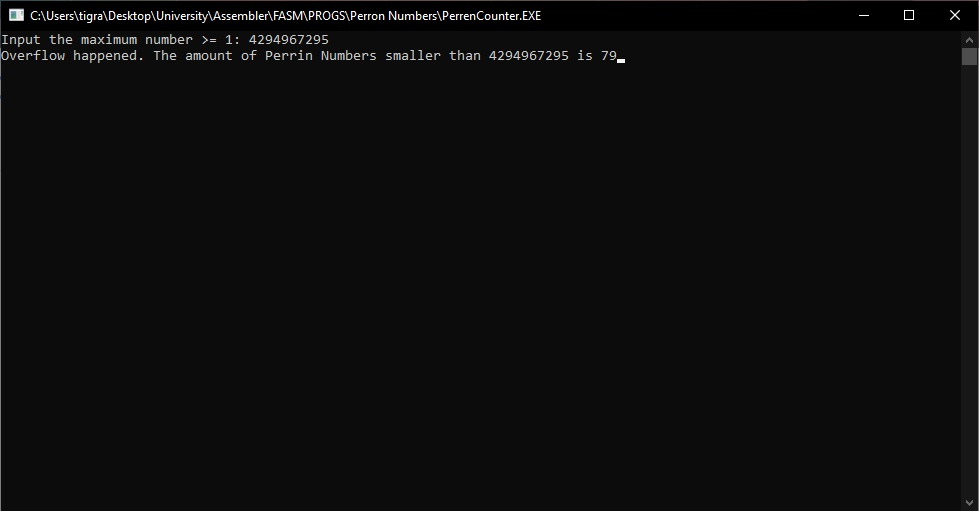
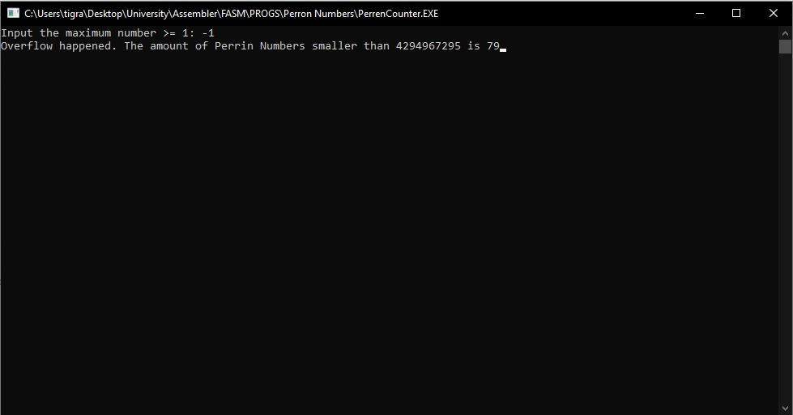
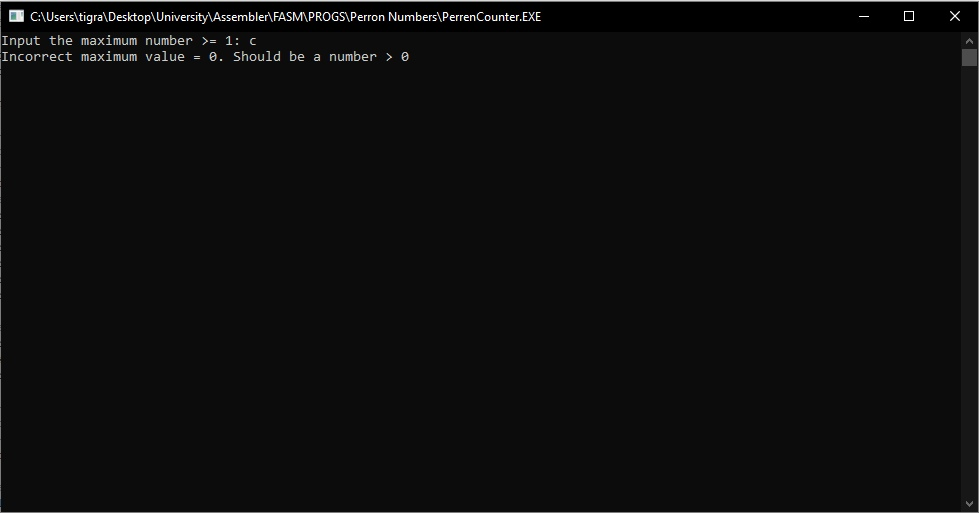
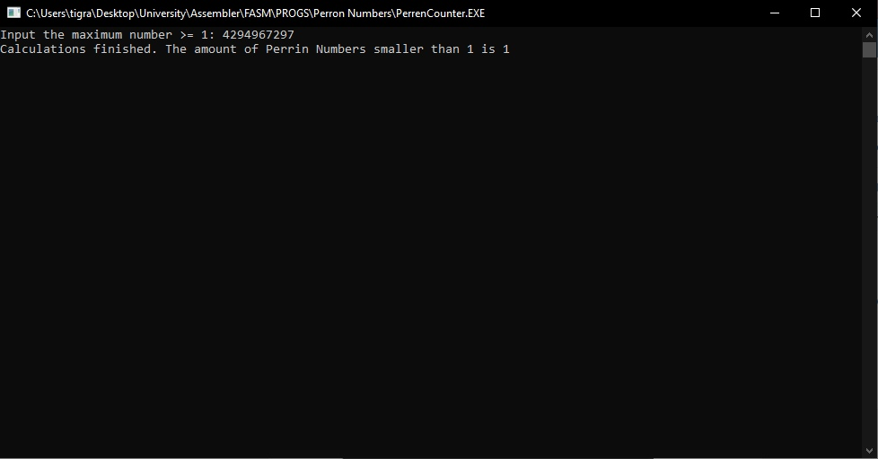
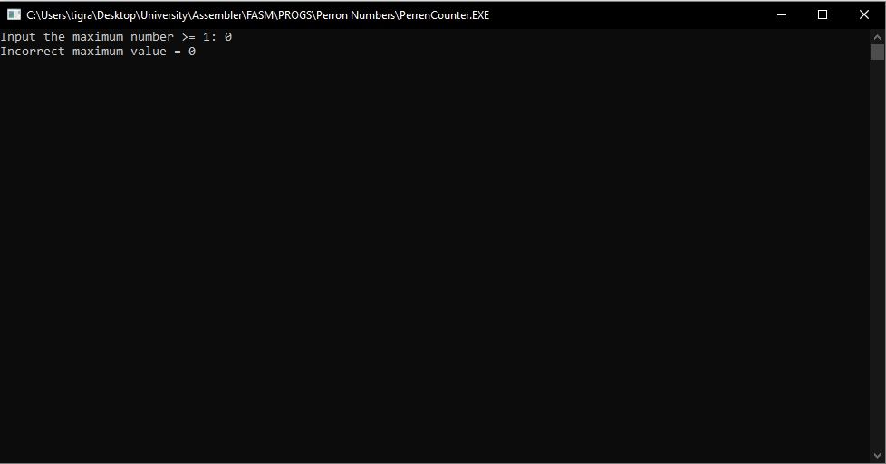
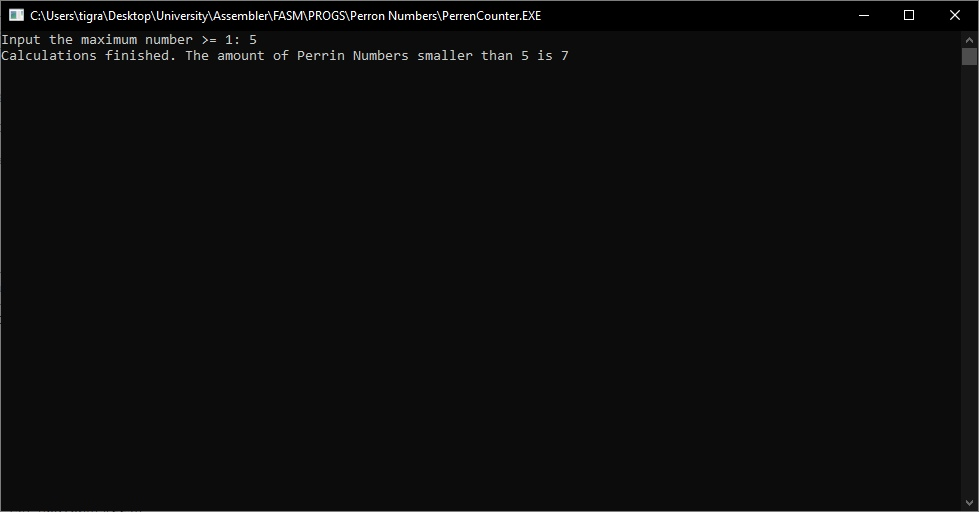

# Программа для определения количества чисел Перрена от 1 до беззнакового машинного слова.
## Выполнил студент БПИ199 Кочарян Тигран Самвелович <tskocharyan@edu.hse.ru>.
---

## Описание работы программы:

---
## Примеры работы кода:

#### Скриншот 1. Ввод размера максимального числа беззнакового машинного слова - 2^32-1. Вывод корректного ответа 79.

#### Скриншот 2. Ввод отрицательного числа. Взятие числа по модулю 2^32 и вывод ответа.

#### Скриншот 3. Ввод символа. Вывод сообщения об ошибке.

#### Скриншот 4. Ввод числа, которое > 2^32. Взятие числа по модулю 2^32 и вывод ответа.

#### Скриншот 5. Ввод числа 0, которое не подходит под условие. Вывод сообщения об ошибке.

#### Скриншот 6. Ввод числа 5, которое подходит под условие. Вывод корректного ответа 7.

---
## [Контакты.](https://vk.com/k_tigran)
